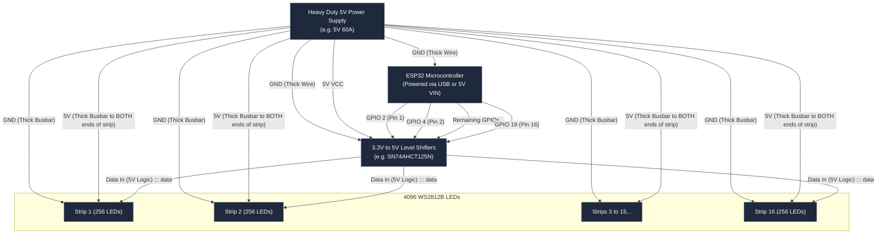

# ESP32 to LED Wiring Diagram

This layout illustrates how to safely and effectively distribute power and data to your 16 LED data lines across 4096 LEDs. 

> [!CAUTION]
> **Power Injection**: The 5V and GND lines must be connected to both the beginning AND the end of each strip (or frequently throughout) to prevent voltage drop and dimming. **Do not** daisy-chain the 5V power sequentially through all 4096 LEDs.

### Important Wiring Notes:

1. **Common Ground**: It is absolutely critical that the Ground (GND) of your ESP32, the Level Shifter, the Power Supply, and the LED strips are all tied together. If they do not share a common ground, the data signals will be corrupted and the LEDs will flicker wildly.
2. **Level Shifter**: The ESP32 outputs a 3.3V data signal, but WS2812B LEDs expect a 5V data signal. Using an SN74AHCT125N or similar logic level shifter ensures stable, flicker-free data transmission to the first LED of each strip.
3. **Thick Busbars**: Due to the high current (Amperage) drawn by the LED strips, use thick copper wire (like 12 AWG or 14 AWG) from the Power Supply to run alongside your setup, and "tap" into these busbars to inject power into the strips with thinner wire.
